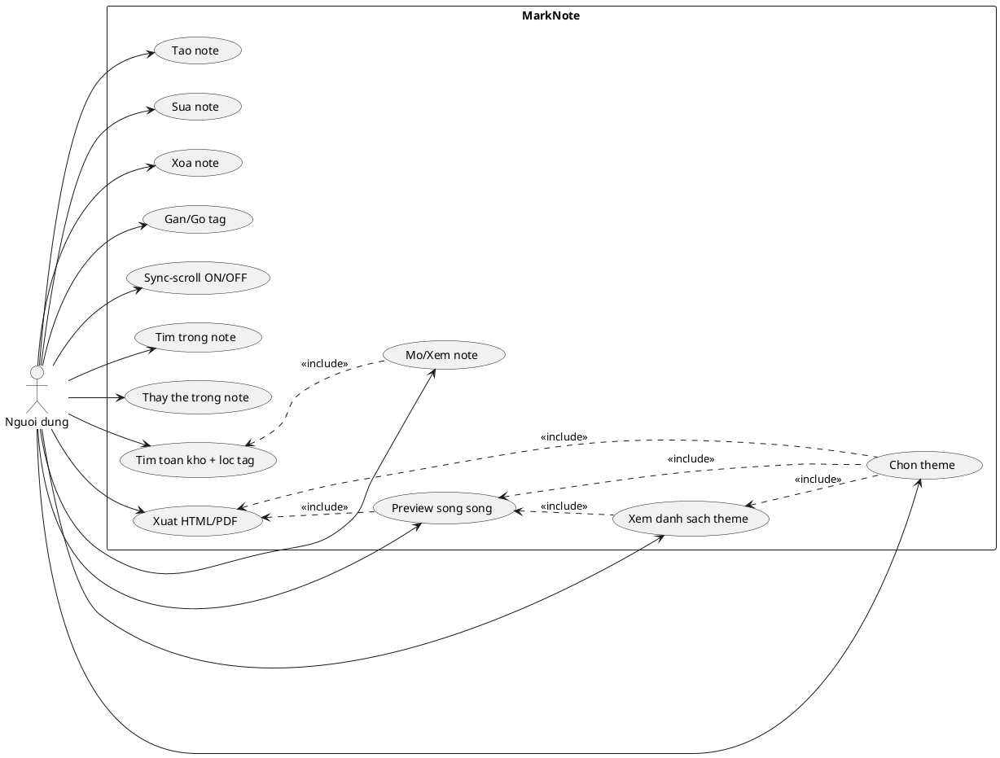
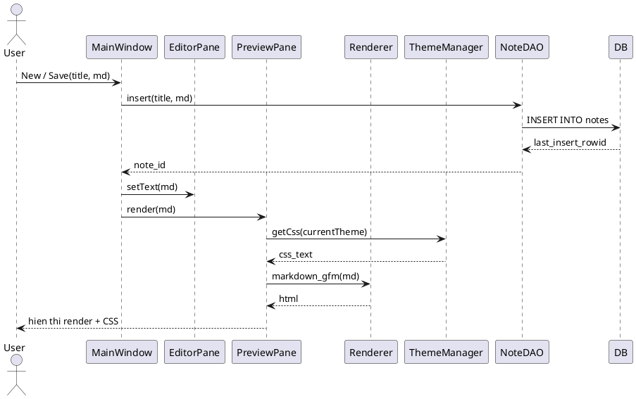
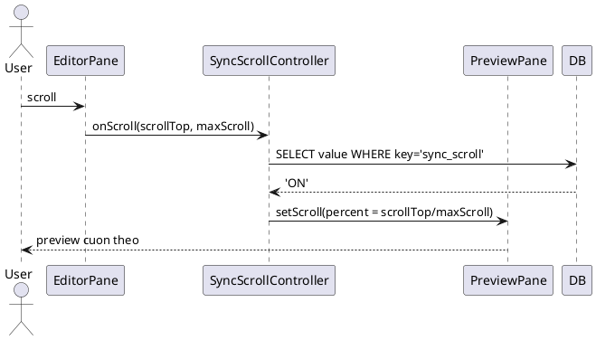
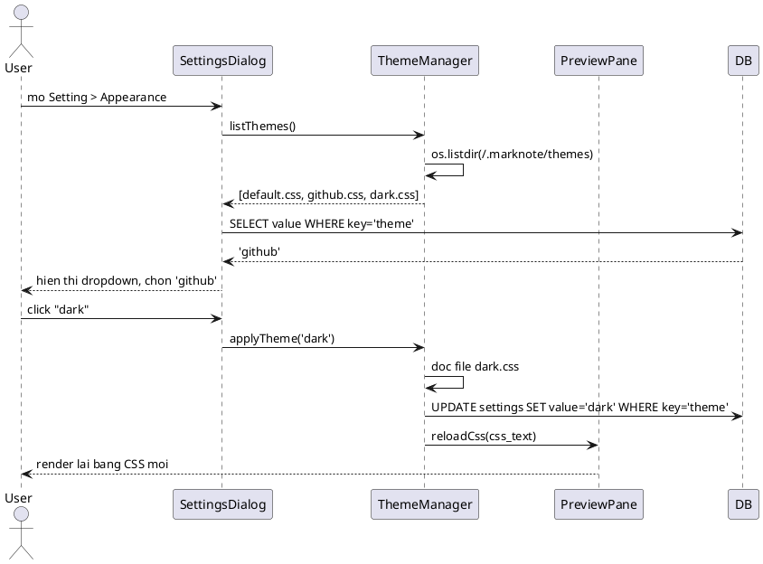
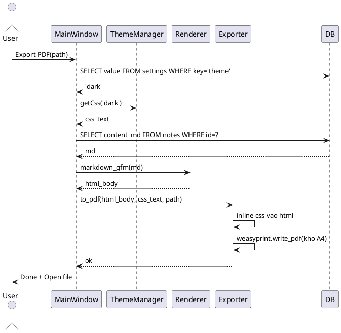
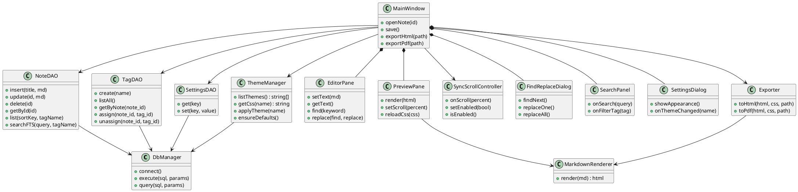

# KẾ HOẠCH DỰ ÁN: MarkNote - Ghi chú Markdown offline cho Linux

## 1. Thông tin chung

* **Tên đề tài:** Phần mềm ghi chú Markdown offline hỗ trợ preview song song, chọn theme CSS và xuất HTML/PDF
* **Phân loại (Bài 7):** Ứng dụng Desktop nguồn mở
* **Nền tảng:** Linux Ubuntu/Fedora, chạy offline 100%
* **Stack:** Python 3 + PySide6/Qt (QWebEngineView) + SQLite3 + FTS5 + markdown-it-py (GFM) + Pygments + WeasyPrint
* **Giấy phép:** MIT
* **Scope chốt:** Editor chia đôi + preview live + sync-scroll + tìm/thay trong note + tìm toàn kho + tag + chọn theme CSS + xuất HTML/PDF. Không làm sync cloud, không collab realtime, không version history.

```
marknote-1.0/
 Makefile  LICENSE  README.md  CHANGELOG  requirements.txt
 src/main.py  src/db.py  src/editor.py  src/preview.py
 src/exporter.py  src/theme.py  src/settings.py
 assets/themes/default.css
 assets/themes/github.css
 assets/themes/dark.css
```

Theme người dùng: `~/.marknote/themes/*.css`
DB: `~/.marknote/notes.db`

## 2. Actor

* **U01 - Người dùng:** toàn quyền tạo, mở, sửa, xóa, tag, tìm kiếm, thay thế, chọn theme, xuất HTML/PF.

App offline single-user nên 1 actor là hợp lý. Nếu thầy yêu cầu 2 actor thì thêm **U02 - Khách xem (read-only)**: chỉ mở, tìm, xuất, không sửa/xóa.

## 3. DB SQLite lưu cái gì?

File duy nhất: `~/.marknote/notes.db`. Không lưu file `.md` rời. Không lưu HTML render, không lưu nội dung CSS trong DB.

### 3.1 `notes` - nội dung gốc của note
`id, title, content_md, created_at, updated_at, pinned, archived`

Ví dụ: `1 | Cài LAMP Ubuntu | # LAMP\n```bash\nsudo apt... | 2026-10-01 | 2026-10-01 | 1 | 0`

Chỉ lưu `content_md` thô. Preview parse ra HTML mỗi lần render.

### 3.2 `tags` - từ khóa phân loại
`id, name UNIQUE, color`

Ví dụ: `1, linux, blue` / `2, lab, green`

### 3.3 `note_tag` - quan hệ N-N note <-> tag
`note_id, tag_id, PK(note_id, tag_id)`

Ví dụ: note 1 gắn 2 tag -> `(1,1), (1,2)`. Xóa note -> `ON DELETE CASCADE`.

### 3.4 `settings` - cấu hình app
`key, value`

Ví dụ: `theme=dark`, `sync_scroll=ON`, `last_opened_id=1`

**Quan trọng:** `settings.theme` chỉ lưu **tên file** (`dark`), không lưu nội dung CSS. Nội dung CSS nằm ở file thật `~/.marknote/themes/dark.css`.

### 3.5 `notes_fts` - index tìm kiếm nhanh
`VIRTUAL TABLE USING fts5(title, content_md)`. Không phải dữ liệu chính, chỉ là index.

## 4. Theme CSS - thiết kế

### 4.1 Nguyên tắc

* Theme là **file `.css` thật trên đĩa**, không nhét CSS vào DB.
* Khi cài đặt, `make install` copy 3 theme mặc định từ `assets/themes/` sang `~/.marknote/themes/`.
* Preview, xuất HTML và xuất PDF **dùng chung một theme** đang chọn. Không cần 3 UC riêng.
* Hệ thống tự quét folder, không cần lưu danh sách trong DB.

### 4.2 Cơ chế hoạt động

1. Mở Setting > Appearance -> hệ thống `os.listdir('~/.marknote/themes')`, lọc `.css`.
2. Đổ danh sách vào QComboBox.
3. Chọn item nào -> `UPDATE settings theme='<tên file>'`.
4. `ThemeManager.getCss(name)` đọc nội dung file -> nhúng vào `<style>` của QWebEngineView -> re-render.
5. Khi xuất HTML/PDF, nhúng CSS trực tiếp vào file -> file đọc được offline độc lập, không cần file CSS cạnh bên.

Nếu file `.css` bị xóa ngoài, khi mở app sẽ báo "Theme file missing" và tự reset về `default.css`.

### 4.3 Nội dung file `default.css`

Yêu cầu: giống GitHub MarkdownRendering nhất có thể — dùng đúng bảng màu Primer của GitHub, font stack `-apple-system / Segoe UI`, code block nền xám `#f6f8fa`, highlight code màu xanh `#0969da`.

File này phủ hết thẻ GFM: heading, bold/italic/strike, code inline, code block, table, blockquote, task list, footnote, hr, img, kbd, link, highlight tìm kiếm, và `@media print` cho xuất PDF.

```css
/* ============================================================
   default.css - Giao dien Markdown mac dinh, mo phong GitHub
   Ban ve dua tren bo mau Primer cua GitHub
   ============================================================ */

/* --- 1. Bien CSS (design token) --- */
:root {
  /* Nen & chu */
  --canvas:            #ffffff;
  --canvas-subtle:     #f6f8fa;
  --fg-default:        #1f2328;
  --fg-muted:          #59636e;
  --fg-on-emphasis:    #ffffff;

  /*Vien */
  --border-default:    #d1d9e0;
  --border-muted:      #d8dee4;

  /*Mau nhan */
  --accent-fg:         #0969da;
  --accent-emphasis:   #0969da;
  --danger-fg:         #cf222e;
  --success-fg:        #1a7f37;
  --attention-fg:      #9a6700;
  --done-fg:           #8250df;
  --neutral-muted:     rgba(175, 184, 193, 0.2);

  /*Highlight tim kiem */
  --mark-bg:           #fff8c5;
  --mark-text:         #1f2328;

  /*Font */
  --font-sans: -apple-system, BlinkMacSystemFont, "Segoe UI", "Noto Sans",
               Helvetica, Arial, sans-serif;
  --font-mono: ui-monospace, SFMono-Regular, "SF Mono", Menlo, Consolas,
               "Liberation Mono", monospace;
}

/* --- 2. Reset co ban + body --- */
* { box-sizing: border-box; }

html { -webkit-text-size-adjust: 100%; }

body {
  margin: 0;
  padding: 32px 16px;
  background: var(--canvas);
  color: var(--fg-default);
  font-family: var(--font-sans);
  font-size: 16px;
  line-height: 1.5;
  word-wrap: break-word;
}

.markdown-body {
  max-width: 1012px;
  margin: 0 auto;
  line-height: 1.5;
  word-wrap: break-word;
}

/* --- 3. Tieu de --- */
.markdown-body h1,
.markdown-body h2,
.markdown-body h3,
.markdown-body h4,
.markdown-body h5,
.markdown-body h6 {
  margin-top: 24px;
  margin-bottom: 16px;
  font-weight: 600;
  line-height: 1.25;
}

.markdown-body h1 { font-size: 2em;    padding-bottom: .3em; }
.markdown-body h2 { font-size: 1.5em;  padding-bottom: .3em; }
.markdown-body h3 { font-size: 1.25em; }
.markdown-body h4 { font-size: 1em; }
.markdown-body h5 { font-size: .875em; }
.markdown-body h6 { font-size: .85em;  color: var(--fg-muted); }

/* GitHub: border duoi dung cho h1 h2 */
.markdown-body h1,
.markdown-body h2 {
  border-bottom: 1px solid var(--border-muted);
  padding-bottom: .3em;
}

/* Danh sach muc luc ket hop heading */
.markdown-body h1:first-child,
.markdown-body h2:first-child,
.markdown-body h3:first-child { margin-top: 0; }

/* --- 4. Doan van, lien ket --- */
.markdown-body p { margin-top: 0; margin-bottom: 16px; }

.markdown-body a {
  color: var(--accent-fg);
  text-decoration: none;
  background-color: transparent;
}
.markdown-body a:hover { text-decoration: underline; }

/* Link tu dong (GFM autolink) duoc gan class tu-dung-link */
.markdown-body a[data-autolink="true"] { word-break: break-all; }

/* --- 5. Dinh dang chu inline --- */
.markdown-body strong { font-weight: 600; }
.markdown-body em { font-style: italic; }

/* Gach ngang GFM */
.markdown-body del,
.markdown-body s { text-decoration: line-through; }

.markdown-body mark {
  background: var(--mark-bg);
  color: var(--mark-text);
  padding: 0 2px;
}

/* Phim tắt kbd */
.markdown-body kbd {
  display: inline-block;
  padding: 3px 5px;
  font-family: var(--font-mono);
  font-size: 11px;
  line-height: 10px;
  color: var(--fg-default);
  vertical-align: middle;
  background-color: var(--canvas-subtle);
  border: solid 1px var(--border-muted);
  border-bottom-color: var(--border-default);
  border-radius: 6px;
  box-shadow: inset 0 -1px 0 var(--neutral-muted);
}

/* --- 6. Code inline --- */
.markdown-body code {
  padding: .2em .4em;
  margin: 0;
  font-family: var(--font-mono);
  font-size: 85%;
  white-space: break-spaces;
  background-color: var(--neutral-muted);
  border-radius: 6px;
}

/* --- 7. Code block --- */
.markdown-body pre {
  padding: 16px;
  margin-top: 0;
  margin-bottom: 16px;
  font-size: 85%;
  line-height: 1.45;
  color: var(--fg-default);
  background-color: var(--canvas-subtle);
  border-radius: 6px;
  overflow: auto;
  word-wrap: normal;
}

/* Code block co ngon ngu: them vien bang bang cach dung before */
.markdown-body pre[data-lang]::before {
  content: attr(data-lang);
  display: block;
  margin-bottom: 8px;
  font-size: 11px;
  font-weight: 600;
  text-transform: uppercase;
  letter-spacing: .05em;
  color: var(--fg-muted);
}

/* Bo nen trong code block vi pre da co nen */
.markdown-body pre code {
  padding: 0;
  margin: 0;
  font-size: 100%;
  line-height: inherit;
  background-color: transparent;
  border: 0;
  white-space: pre;
}

/* --- 8. Blockquote --- */
.markdown-body blockquote {
  padding: 0 1em;
  margin: 0 0 16px;
  color: var(--fg-muted);
  border-left: .25em solid var(--border-default);
}
.markdown-body blockquote > :first-child { margin-top: 0; }
.markdown-body blockquote > :last-child  { margin-bottom: 0; }

/* --- 9. Danh sach --- */
.markdown-body ul,
.markdown-body ol { margin-top: 0; margin-bottom: 16px; padding-left: 2em; }

.markdown-body ul { list-style: disc; }
.markdown-body ol { list-style: decimal; }
.markdown-body ul ul { list-style: circle; }
.markdown-body ol ol { list-style: lower-alpha; }
.markdown-body ul ul ul { list-style: square; }

.markdown-body li { margin-top: 0; }
.markdown-body li + li { margin-top: 4px; }

.markdown-body li > p { margin-top: 16px; }

/* Task list GFM: - [ ] va - [x] */
.markdown-body ul.task-list-item {
  list-style: none;
  padding-left: 0;
}
.markdown-body ul.task-list-item input[type="checkbox"] {
  margin: 0 .2em .25em -1.6em;
  vertical-align: middle;
  width: 16px;
  height: 16px;
  accent-color: var(--accent-emphasis);
}
.markdown-body ul.task-list-item li { margin-top: 4px; }

/* --- 10. Bang --- */
.markdown-body table {
  display: block;
  width: max-content;
  max-width: 100%;
  overflow: auto;
  border-spacing: 0;
  border-collapse: collapse;
  margin-top: 0;
  margin-bottom: 16px;
}

.markdown-body table th,
.markdown-body table td {
  padding: 6px 13px;
  border: 1px solid var(--border-default);
}

.markdown-body table th {
  font-weight: 600;
  background-color: var(--canvas-subtle);
}

.markdown-body table tr:nth-child(2n) {
  background-color: var(--canvas-subtle);
}

.markdown-body table img { max-width: none; }

/* --- 11. Duong ke --- */
.markdown-body hr {
  height: .25em;
  padding: 0;
  margin: 24px 0;
  background-color: var(--border-default);
  border: 0;
}

/* --- 12. Anh --- */
.markdown-body img {
  max-width: 100%;
  box-sizing: content-box;
  background-color: var(--canvas);
}

/* --- 13. Footnote GFM --- */
.markdown-body .footnotes {
  margin-top: 2em;
  padding-top: 1em;
  border-top: 1px solid var(--border-muted);
  font-size: 14px;
  color: var(--fg-muted);
}
.markdown-body .footnotes ol { padding-left: 1.5em; }
.markdown-body .footnote-ref {
  padding: 0 2px;
  font-size: 85%;
  vertical-align: super;
  text-decoration: none;
}
.markdown-body .footnote-backref { text-decoration: none; }

/* --- 14. Highlight tim kiem trong Editor (app tu them) --- */
.find-highlight {
  background: var(--mark-bg);
  color: var(--mark-text);
  border-radius: 2px;
}
.find-current {
  background: #f8b886;
  outline: 1px solid #d1560b;
}

/* --- 15. Table of contents (tu sinh) --- */
.markdown-body .toc {
  padding: 12px 16px;
  margin-bottom: 24px;
  background: var(--canvas-subtle);
  border: 1px solid var(--border-muted);
  border-radius: 6px;
  font-size: 14px;
}
.markdown-body .toc ul { margin-bottom: 0; }

/* --- 16. In khi xuat PDF --- */
@media print {
  body { padding: 0; font-size: 11pt; }
  .markdown-body { max-width: none; }
  .markdown-body pre,
  .markdown-body table,
  .markdown-body blockquote { page-break-inside: avoid; }
  .markdown-body h1,
  .markdown-body h2,
  .markdown-body h3 { page-break-after: avoid; }
  .markdown-body a { color: inherit; text-decoration: underline; }
  a[href^="http"]::after {
    content: " (" attr(href) ")";
    font-size: 9pt;
    color: var(--fg-muted);
  }
}
```

### 4.4 Ba theme mặc định và khác biệt

| File | Nội dung |
|---|---|
| `default.css` | Bản trên - mô phỏng GitHub, dùng làm chuẩn |
| `github.css` | Giống `default.css`, chỉ khác chiều rộng `max-width: 1280px` cho note dài |
| `dark.css` | Cùng cấu trúc, chỉ ghi đè `:root` sang nền tối + đổi màu chữ/viền, giữ nguyên phần layout |

Vì cả 3 theme dùng chung một bộ class `.markdown-body`, người dùng copy `default.css` ra file mới rồi sửa màu là có theme riêng, không cần đụng code Python.

## 5. Use-Case - 13 UC

### UC01 - Tạo note mới
* Pre: App đang mở
* Main: 1. Bấm New -> 2. Nhập title -> 3. Nhập content_md -> 4. Bấm Save -> `INSERT INTO notes(title, content_md, updated_at)`
* Post: Thêm 1 dòng `notes`, note mới xuất hiện trong list

### UC02 - Mở/Xem note
* Main: 1. Click note trong list -> 2. `SELECT title, content_md FROM notes WHERE id=?` -> 3. Đổ `content_md` vào Editor trái + render Preview phải

### UC03 - Sửa note
* Main: 1. Sửa text trong Editor -> 2. Ctrl+S -> 3. `UPDATE notes SET content_md=?, updated_at=? WHERE id=?` -> 4. Preview re-render

### UC04 - Xóa note
* Main: 1. Bấm Delete -> 2. Hộp thoại xác nhận -> 3. `DELETE FROM notes WHERE id=?` (cascade xóa `note_tag`)

### UC05 - Gán/Gỡ tag cho note
* Main gán: 1. Mở note -> 2. Tick tag -> `INSERT OR IGNORE INTO note_tag(note_id, tag_id)`
* Main gỡ: 1. Untick tag -> `DELETE FROM note_tag WHERE note_id=? AND tag_id=?`
* Main tạo tag mới: Nhập tên -> `INSERT INTO tags(name)` -> gắn luôn vào note

### UC06 - Xem Preview song song
* Main: 1. Mở note -> 2. Layout chia 2 panel bằng QSplitter -> 3. Editor trái hiện `content_md` -> 4. Preview phải parse `content_md` qua `markdown-it-py` (GFM) + Pygments -> 5. Nhúng CSS theme -> hiển thị HTML
* Mỗi lần gõ có debounce 300ms -> re-render

### UC07 - Bật/Tắt Sync-scroll
* Main ON: 1. Bấm nút Sync -> 2. Lưu `UPDATE settings value='ON' WHERE key='sync_scroll'` -> 3. Khi cuộn Editor: tính `percent = scrollTop / maxScroll` -> set `scrollTop` tương ứng cho Preview
* Main OFF: hai panel cuộn độc lập

### UC08 - Tìm trong note hiện tại
* Main: 1. Ctrl+F -> 2. Nhập keyword -> 3. Highlight vàng mọi vị trí trong Editor -> 4. Enter = next, Shift+Enter = prev, hiện `3/12`

### UC09 - Thay thế trong note
* Main: 1. Ctrl+H -> 2. Nhập find + replace -> 3. Bấm Replace / Replace All -> 4. Báo `Đã thay 12 vị trí` -> 5. `UPDATE notes SET content_md` -> 6. Preview re-render

### UC10 - Tìm toàn kho + lọc tag
* Main: 1. Nhập ô Search `apache tag:linux` -> 2. Query `notes_fts MATCH` + `JOIN note_tag` -> 3. Trả list kèm highlight từ khóa -> 4. Click để mở
* Main lọc: Chọn tag trong sidebar -> `SELECT ... WHERE tag.name=?` -> list thu hẹp
* Sort: `ORDER BY pinned DESC, updated_at DESC`

### UC11 - Xem danh sách theme
* Main: 1. Mở Setting > Appearance -> 2. `os.listdir('~/.marknote/themes')` lọc `.css` -> 3. Đổ vào QComboBox -> 4. Chọn sẵn item theo `settings.theme`

### UC12 - Chọn theme
* Pre: Folder theme có ít nhất `default.css`
* Main: 1. User click 1 theme trong dropdown -> 2. `ThemeManager.getCss(name)` đọc file -> 3. `UPDATE settings SET value='<name>' WHERE key='theme'` -> 4. Preview re-render với CSS mới -> 5. Không cần restart
* Ngoại lệ: 2a. File không tồn tại -> báo "Theme file missing", hỏi reset về `default`. 2b. CSS sai cú pháp -> cảnh báo, giữ theme cũ.

### UC13 - Xuất HTML / PDF
* Main HTML: 1. Bấm Export HTML -> 2. Chọn path -> 3. Đọc CSS theme đang chọn -> 4. Ghép `html + css inline` -> ghi `.html`
* Main PDF: 1. Bấm Export PDF -> 2. Chọn path -> 3. Lấy HTML như trên -> 4. `WeasyPrint(html).write_pdf(path)` khổ A4
* Cả hai dùng chung theme -> UC13 gộp 2 lựa chọn vì khác nhau đúng 1 bước kỹ thuật

## 6. Đặc tả chi tiết mẫu

### UC03 - Sửa note

* Actor: Người dùng
* Pre: Đang mở note id=1, DB kết nối OK
* Post: `notes.content_md` và `updated_at` được cập nhật, Preview hiển thị nội dung mới
* Luồng chính:
1. User gõ nội dung mới trong Editor
2. User nhấn Ctrl+S
3. Hệ thống `UPDATE notes SET content_md=?, updated_at=CURRENT_TIMESTAMP WHERE id=1`
4. Hệ thống gọi `PreviewPane.render(content_md)`
5. List note cập nhật thời gian sửa
* Luồng thay thế: 3a. User không đổi gì -> báo "Không có thay đổi", bỏ qua update
* Ngoại lệ: 3b. DB locked -> báo "Database is locked, thử lại"

### UC12 - Chọn theme

* Actor: Người dùng
* Pre: Folder `~/.marknote/themes/` có ít nhất `default.css`
* Post: `settings.theme` đổi giá trị, Preview render lại với CSS mới
* Luồng chính:
1. User mở Setting > Appearance
2. Hệ thống quét folder, đổ danh sách `.css` vào dropdown
3. User click chọn theme `dark`
4. Hệ thống đọc nội dung `~/.marknote/themes/dark.css`
5. `UPDATE settings SET value='dark' WHERE key='theme'`
6. Preview nhúng CSS mới và re-render
* Ngoại lệ:
  * 4a. File `.css` không tồn tại -> báo "Theme file missing", hỏi reset về `default.css`
  * 4b. CSS sai cú pháp -> cảnh báo, render bằng theme trước đó
  * 2a. Folder rỗng -> copy `assets/themes/*.css` từ thư mục cài đặt sang rồi quét lại

## 7. Sơ đồ Use-Case



Quan hệ `<<include>>` nghĩa là: muốn Preview hay Xuất thì bắt buộc phải có theme được chọn trước.

## 8. Sơ đồ tuần tự

**a. Tạo note + Preview render (UC01, UC06)**



**b. Sync-scroll (UC07)**



**c. Chọn theme (UC12)**



**d. Xuất PDF dùng theme đang chọn (UC13)**



## 9. Sơ đồ lớp



## 10. Sơ đồ dữ liệu và SQL tạo DB

```sql
PRAGMA foreign_keys = ON;

CREATE TABLE notes(
  id INTEGER PRIMARY KEY AUTOINCREMENT,
  title TEXT NOT NULL,
  content_md TEXT,
  created_at DATETIME DEFAULT CURRENT_TIMESTAMP,
  updated_at DATETIME DEFAULT CURRENT_TIMESTAMP,
  pinned INT DEFAULT 0,
  archived INT DEFAULT 0
);

CREATE TABLE tags(
  id INTEGER PRIMARY KEY AUTOINCREMENT,
  name TEXT UNIQUE NOT NULL,
  color TEXT
);

CREATE TABLE note_tag(
  note_id INT,
  tag_id INT,
  PRIMARY KEY(note_id, tag_id),
  FOREIGN KEY(note_id) REFERENCES notes(id) ON DELETE CASCADE,
  FOREIGN KEY(tag_id) REFERENCES tags(id) ON DELETE CASCADE
);

CREATE TABLE settings(
  key TEXT PRIMARY KEY,
  value TEXT
);

INSERT INTO settings(key, value) VALUES
  ('theme', 'default'),
  ('sync_scroll', 'ON'),
  ('last_opened_id', '0');

CREATE VIRTUAL TABLE notes_fts USING fts5(
  title, content_md, content='notes', content_rowid='id'
);

-- Trigger dong bo FTS khi notes thay doi
CREATE TRIGGER notes_ai AFTER INSERT ON notes BEGIN
  INSERT INTO notes_fts(rowid, title, content_md)
  VALUES (new.id, new.title, new.content_md);
END;

CREATE TRIGGER notes_ad AFTER DELETE ON notes BEGIN
  INSERT INTO notes_fts(notes_fts, rowid, title, content_md)
  VALUES ('delete', old.id, old.title, old.content_md);
END;

CREATE TRIGGER notes_au AFTER UPDATE ON notes BEGIN
  INSERT INTO notes_fts(notes_fts, rowid, title, content_md)
  VALUES ('delete', old.id, old.title, old.content_md);
  INSERT INTO notes_fts(rowid, title, content_md)
  VALUES (new.id, new.title, new.content_md);
END;
```

Các câu SQL chính dùng trong UC:

| UC | SQL |
|---|---|
| UC01 | `INSERT INTO notes(title, content_md, updated_at) VALUES(?,?,CURRENT_TIMESTAMP)` |
| UC02 | `SELECT title, content_md FROM notes WHERE id=?` |
| UC03 | `UPDATE notes SET content_md=?, updated_at=CURRENT_TIMESTAMP WHERE id=?` |
| UC04 | `DELETE FROM notes WHERE id=?` |
| UC05 | `INSERT OR IGNORE INTO note_tag(note_id, tag_id) VALUES(?,?)` |
| UC07 | `UPDATE settings SET value='ON' WHERE key='sync_scroll'` |
| UC09 | `UPDATE notes SET content_md=? WHERE id=?` |
| UC10 | `SELECT n.id,n.title FROM notes_fts f JOIN notes n ON n.id=f.rowid JOIN note_tag nt ON nt.note_id=n.id JOIN tags t ON t.id=nt.tag_id WHERE notes_fts MATCH ? AND t.name=?` |
| UC12 | `UPDATE settings SET value=? WHERE key='theme'` |

## 11. Tính năng Markdown - GitHub Flavored Markdown đầy đủ

Dùng `markdown-it-py` bật `commonmark` + GFM + `Pygments` highlight.

### 11.1 Cú pháp cơ bản

| Nhóm | Cú pháp |
|---|---|
| Heading | `#` đến `######`, setext (`===`, `---`) |
| Định dạng | `**bold**`, `*italic*`, `~~strike~~`, `__bold__`, `_italic_` |
| Code inline | `` `code` `` |
| Code block | ` ```python `, ` ```bash `, ` ```diff `... highlight Pygments |
| Link | `[text](url)`, `[text](url "title")`, autolink `<http://...>` |
| Ảnh | ``, hỗ trợ ảnh local và base64 |
| Trích dẫn | `> quote`, nhiều tầng `>>` |
| Danh sách | `-`, `*`, `+`, `1.`, lồng nhau 2-3 cấp |
| Checklist | `- [ ]` chưa làm, `- [x]` đã làm |
| Đường kẻ | `---`, `***`, `___` |
| Bảng | `\| a \| b \|` + `\|---\|:---:\|---:\|` |
| HTML inline | `<b>`, ``, `<div>`, `<details>` |
| Escaping | `\*` để hiện ký tự đặc biệt |
| Footnote | `[^1]` và định nghĩa `[^1]: ...` |

### 11.2 Cú pháp riêng của GitHub

| Tính năng | Ví dụ |
|---|---|
| Autolink | `github.com` -> link tự động |
| Task list | `- [x] done` |
| Strikethrough | `~~xong~~` |
| Bảng căn chỉnh | `\|:---\|:---:\|---:\|` |
| URL tự ngắt dòng | Link dài tự wrap |
| Highlight code | ```diff, ```python, ```js, ```bash, ```sql |

### 11.3 Không làm

Math LaTeX, Mermaid/diagram, plugin tùy chỉnh, embed video, xuất gộp nhiều note.

## 12. Kế hoạch triển khai theo tuần

* Tuần 1: Schema DB + trigger FTS5 + `DbManager`, `NoteDAO`, `TagDAO`, `SettingsDAO`
* Tuần 2: UC01-UC05 (CRUD note + tag) + layout PySide6 cơ bản + list note
* Tuần 3: UC06 Preview GFM + `MarkdownRenderer` + 3 file theme CSS
* Tuần 4: UC07 Sync-scroll + UC08/UC09 tìm và thay thế trong note
* Tuần 5: UC10 tìm toàn kho FTS + lọc tag + sort
* Tuần 6: UC11/UC12 theme manager + UC13 xuất HTML/PDF
* Tuần 7: `make install`, release `marknote-1.0.tar.gz`, README, CHANGELOG, LICENSE, video demo

## 13. Tính năng mở rộng (không phải làm, chỉ ghi trong báo cáo)

* Ghim / lưu trữ note nâng cao (hiện chỉ dùng cột `pinned`, `archived` để sort)
* Tạo - sửa - xóa theme trong giao diện (hiện chỉ chọn file có sẵn)
* Sao lưu / khôi phục file `notes.db`
* Lịch sử phiên bản note và khôi phục
* Xuất nhiều note gộp một file HTML/PDF
* Chế độ dark tự động theo giờ trong ngày

## 14. Đánh giá PoF (Bài 5 - Tom Callaway)

| Hạng mục | Trạng thái | PoF |
|---|---|---|
| Size mã nguồn | < 15MB | 0 |
| Source control | Git public trên GitHub | 0 |
| Web viewer | Có trên GitHub | 0 |
| Tài liệu người mới | README có hướng dẫn chạy | 0 |
| Dịch từ mã nguồn | `make install` + requirements.txt | 0 |
| Gói kèm | Không bundle thư viện, dùng pip | 0 |
| Thư viện | Dùng system libs Python | 0 |
| Cài đặt hệ thống | `make install` -> /usr/local/bin/marknote | 0 |
| Code oddities | Không file DOS, không phụ thuộc MS | 0 |
| Giao tiếp | GitHub Issues + Discussions | 0 |
| Phát hành | v1.0, v1.1 tuần tự, đóng gói .tar.gz | 0 |
| Lịch sử | Dự án mới, không rẽ nhánh | 0 |
| Giấy phép | MIT trong từng file + LICENSE | 0 |
| Tài liệu | Có CHANGELOG + README + docs/TONG_HOP_GFM.md | 0 |

**Tổng: 0 PoF** -> Hoàn hảo, các chỉ số đều hướng tới thành công.

## 15. Tài liệu tham khảo

* Bài giảng Bài 5: Quy trình đánh giá và lựa chọn PMNM (PoF - Tom Callaway)
* Bài giảng Bài 7: Các hệ thống PMNM phổ biến (phân loại theo chức năng)
* Bài giảng Bài 8: Cơ sở dữ liệu nguồn mở
* Bài giảng Bài 10: Thực hành xây dựng PM hướng dịch vụ nguồn mở
* Tài liệu SQLite: https://www.sqlite.org/docs.html
* Tài liệu FTS5: https://www.sqlite.org/fts5.html
* Python-markdown-it-py: https://markdown-it-py.readthedocs.io/