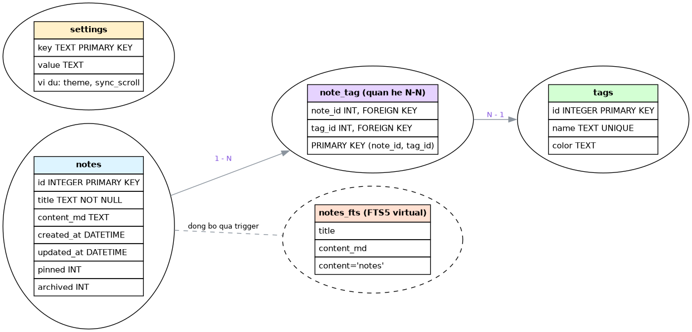

# Co so du lieu cua MarkNote

## 1. Tong quan

MarkNote dung mot file `SQLite` duy nhat:

`~/.marknote/notes.db`

Nguyen tac:

- Chi luu noi dung Markdown tho (cau text) vao bang `notes`, khong
  luu HTML render, khong luu noi dung CSS trong database.
- Preview moi lan render lai tu `content_md`.
- `notes_fts` la bang ao (VIRTUAL TABLE) chi muc FTS5, duoc dong bo
  tu dong qua trigger, khong phai du lieu chinh.
- CSS theme nam o file that `~/.marknote/themes/*.css`, database chi
  luu ten file (vi du `dark`).

Bang tong hop:

| Bang | Vai tro |
|---|---|
| `notes` | Noi dung goc cua note |
| `tags` | Tu khoa phan loai note |
| `note_tag` | Quan he N-N giua note va tag |
| `settings` | Cau hinh ung dung (key - value) |
| `notes_fts` | Chi muc tim kiem FTS5 (bang ao) |

## 2. So do thuc the - quan he (ER)

Chu thich: moi tam la mot bang, duong ke the hien quan he khoa ngoai.



Tep nguon de ve lai: `docs/diagrams/schema_er.dot`.

Cach sinh lai bang Graphviz:

```
dot -Tpng docs/diagrams/schema_er.dot -o docs/diagrams/schema_er.png
```

## 3. Chi tiet tung bang

### 3.1 `notes`

| Cot | Kieu | Rang buoc | Y nghia |
|---|---|---|---|
| `id` | INTEGER | PRIMARY KEY AUTOINCREMENT | Ma note |
| `title` | TEXT | NOT NULL | Tieu de note |
| `content_md` | TEXT | | Noi dung Markdown thô |
| `created_at` | DATETIME | DEFAULT CURRENT_TIMESTAMP | Thoi diem tao |
| `updated_at` | DATETIME | DEFAULT CURRENT_TIMESTAMP | Thoi diem sua gan nhat |
| `pinned` | INT | DEFAULT 0 | Ghim (dung de sap xep) |
| `archived` | INT | DEFAULT 0 | Luu tru (dung de sap xep) |

Vi du dong lieu:

```
1 | Cai LAMP Ubuntu | # LAMP\n... | 2026-10-01 | 2026-10-01 | 1 | 0
```

### 3.2 `tags`

| Cot | Kieu | Rang buoc | Y nghia |
|---|---|---|---|
| `id` | INTEGER | PRIMARY KEY AUTOINCREMENT | Ma tag |
| `name` | TEXT | UNIQUE NOT NULL | Ten tag |
| `color` | TEXT | | Mau hien thi (tuy chon, chua dung) |

Vi du: `1, linux, blue` / `2, lab, green`.

### 3.3 `note_tag`

| Cot | Kieu | Rang buoc | Y nghia |
|---|---|---|---|
| `note_id` | INT | PK, FK -> notes(id) ON DELETE CASCADE | Ma note |
| `tag_id` | INT | PK, FK -> tags(id) ON DELETE CASCADE | Ma tag |

Xoa note hoac tag se tu dong xoa dong quan he (CASCADE).

### 3.4 `settings`

| Cot | Kieu | Rang buoc | Y nghia |
|---|---|---|---|
| `key` | TEXT | PRIMARY KEY | Ten cau hinh |
| `value` | TEXT | | Gia tri cau hinh |

Cac key mac dinh:

| key | Gia tri mac dinh | Y nghia |
|---|---|---|
| `theme` | `default` | Chi luu TEN file CSS, khong luu noi dung |
| `sync_scroll` | `ON` | Bat/tat dong bo cuon |
| `last_opened_id` | `0` | Note mo lan cuoi |

### 3.5 `notes_fts` (bang ao FTS5)

Bang ao chi muc tim kiem:

```
CREATE VIRTUAL TABLE notes_fts USING fts5(
  title, content_md, content='notes', content_rowid='id'
);
```

- `content='notes'` : noi dung that lay tu bang `notes`.
- `content_rowid='id'` : dung cot `notes.id` lam rowid.
- Duoc dong bo tu dong bang 3 trigger: `notes_ai` (INSERT), `notes_au`
  (UPDATE), `notes_ad` (DELETE).

## 4. SQL tao database day du

```sql
PRAGMA foreign_keys = ON;

CREATE TABLE notes(
  id INTEGER PRIMARY KEY AUTOINCREMENT,
  title TEXT NOT NULL,
  content_md TEXT,
  created_at DATETIME DEFAULT CURRENT_TIMESTAMP,
  updated_at DATETIME DEFAULT CURRENT_TIMESTAMP,
  pinned INT DEFAULT 0,
  archived INT DEFAULT 0
);

CREATE TABLE tags(
  id INTEGER PRIMARY KEY AUTOINCREMENT,
  name TEXT UNIQUE NOT NULL,
  color TEXT
);

CREATE TABLE note_tag(
  note_id INT,
  tag_id INT,
  PRIMARY KEY(note_id, tag_id),
  FOREIGN KEY(note_id) REFERENCES notes(id) ON DELETE CASCADE,
  FOREIGN KEY(tag_id) REFERENCES tags(id) ON DELETE CASCADE
);

CREATE TABLE settings(
  key TEXT PRIMARY KEY,
  value TEXT
);

INSERT INTO settings(key, value) VALUES
  ('theme', 'default'),
  ('sync_scroll', 'ON'),
  ('last_opened_id', '0');

CREATE VIRTUAL TABLE notes_fts USING fts5(
  title, content_md, content='notes', content_rowid='id'
);

CREATE TRIGGER notes_ai AFTER INSERT ON notes BEGIN
  INSERT INTO notes_fts(rowid, title, content_md)
  VALUES (new.id, new.title, new.content_md);
END;

CREATE TRIGGER notes_ad AFTER DELETE ON notes BEGIN
  INSERT INTO notes_fts(notes_fts, rowid, title, content_md)
  VALUES ('delete', old.id, old.title, old.content_md);
END;

CREATE TRIGGER notes_au AFTER UPDATE ON notes BEGIN
  INSERT INTO notes_fts(notes_fts, rowid, title, content_md)
  VALUES ('delete', old.id, old.title, old.content_md);
  INSERT INTO notes_fts(rowid, title, content_md)
  VALUES (new.id, new.title, new.content_md);
END;
```

## 5. Cau lenh SQL chinh theo tung Use-Case

| UC | SQL |
|---|---|
| UC01 Tao note | `INSERT INTO notes(title, content_md, updated_at) VALUES(?,?,CURRENT_TIMESTAMP)` |
| UC02 Mo note | `SELECT title, content_md FROM notes WHERE id=?` |
| UC03 Sua note | `UPDATE notes SET content_md=?, updated_at=CURRENT_TIMESTAMP WHERE id=?` |
| UC04 Xoa note | `DELETE FROM notes WHERE id=?` (CASCADE xoa `note_tag`) |
| UC05 Gan tag | `INSERT OR IGNORE INTO note_tag(note_id, tag_id) VALUES(?,?)` |
| UC05 Go tag | `DELETE FROM note_tag WHERE note_id=? AND tag_id=?` |
| UC07 Sync-scroll | `UPDATE settings SET value='ON' WHERE key='sync_scroll'` |
| UC09 Thay the | `UPDATE notes SET content_md=? WHERE id=?` |
| UC10 Tim toan kho | `SELECT n.id, n.title FROM notes_fts f JOIN notes n ON n.id=f.rowid JOIN note_tag nt ON nt.note_id=n.id JOIN tags t ON t.id=nt.tag_id WHERE notes_fts MATCH ? AND t.name=?` |
| UC12 Chon theme | `UPDATE settings SET value=? WHERE key='theme'` |

Sap xep danh sach note: `ORDER BY pinned DESC, updated_at DESC`.

## 6. Kiem tra nhanh bang dong lenh sqlite3

```
sqlite3 ~/.marknote/notes.db ".schema"
sqlite3 ~/.marknote/notes.db "SELECT id, title FROM notes;"
sqlite3 ~/.marknote/notes.db "SELECT * FROM notes_fts WHERE notes_fts MATCH 'apache';"
```