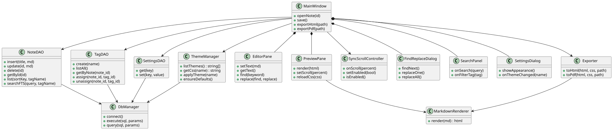

# So do lop

## 1. So do

## 2. Giai thich quan he

| Quan he | Y nghia |
|---|---|
| `MainWindow --> NoteDAO / TagDAO / SettingsDAO` | Su dung cac lop truy cap du lieu |
| `MainWindow *-- EditorPane` | So huu o soan thao (thanh phan) |
| `MainWindow *-- PreviewPane` | So huu khung xem truoc |
| `MainWindow *-- FindReplaceDialog` | So huu hop thoai tim/thay the |
| `MainWindow *-- SearchPanel` | So huu bang dieu huong ben trai |
| `MainWindow *-- SettingsDialog` | So huu hop thoai cai dat |
| `MainWindow --> SyncScrollController` | Su dung bo dieu khien dong bo cuon |
| `MainWindow --> Exporter` | Su dung bo xuat HTML/PDF |
| `MainWindow --> ThemeManager` | Su dung quan ly theme |
| `PreviewPane --> MarkdownRenderer` | Su dung bo render GFM |
| `Exporter --> MarkdownRenderer` | Render GFM khi xuat |
| `ThemeManager --> DbManager` | Doc/luu qua tang database |
| `NoteDAO / TagDAO / SettingsDAO --> DbManager` | Dung chung mot ket noi SQLite |

## 3. Anh xa lop → tep nguon trong ma nguon

| Lop | Tep |
|---|---|
| `MainWindow` | `src/main.py` |
| `DbManager`, `NoteDAO`, `TagDAO`, `SettingsDAO` | `src/db.py` |
| `EditorPane`, `FindReplaceDialog`, `SearchPanel` | `src/editor.py` |
| `PreviewPane`, `MarkdownRenderer`, `SyncScrollController` | `src/preview.py` |
| `ThemeManager` | `src/theme.py` |
| `Exporter` | `src/exporter.py` |
| `SettingsDialog` | `src/settings.py` |

## 4. Tep nguon

`docs/diagrams/lop.puml` - dinh dang PlantUML, xem cach ve trong
`CACH_VE_SO_DO.md`.