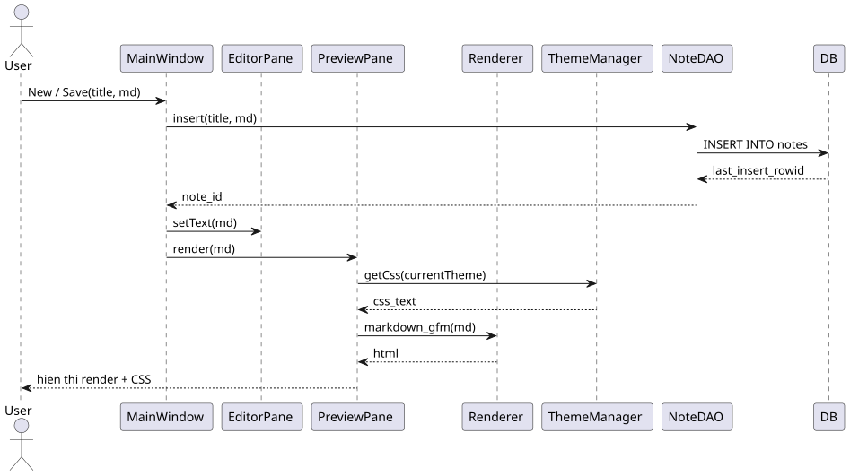
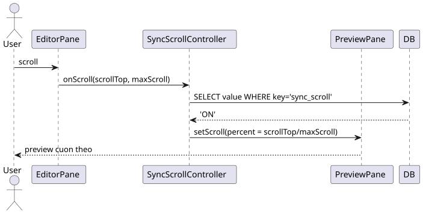
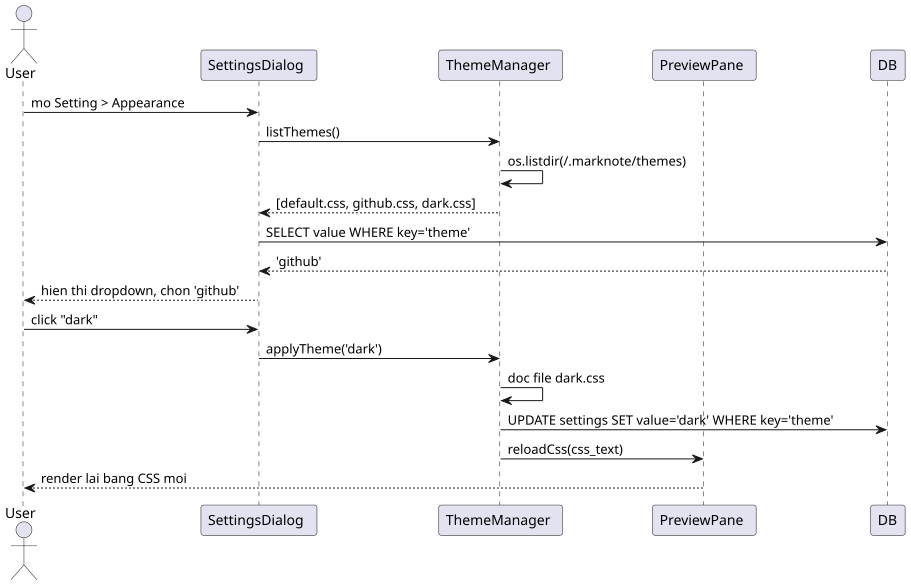
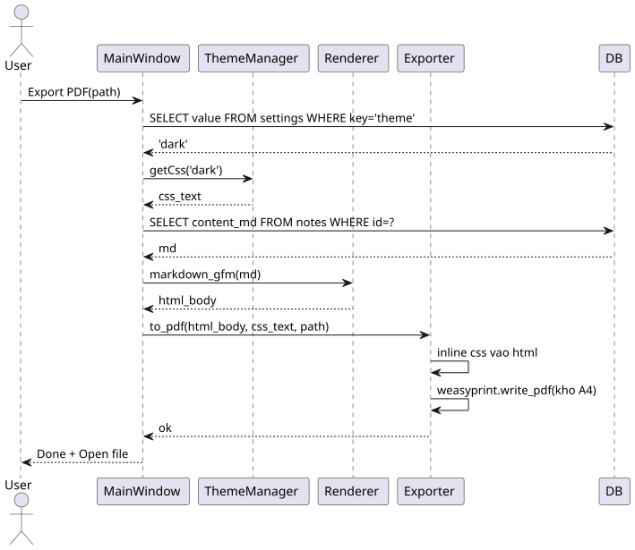

# So do tuan tu

Ben duoi la 4 so do tuan tu the hien cac luong xu ly chinh. Moi so do
deu co tep nguon PlantUML trong `docs/diagrams/`.

## a. Tao note + Preview render (UC01, UC06)

Luong xu ly:

1. User goi New/Save -> MainWindow nhan tieu de va noi dung.
2. NoteDAO ghi vao database, nhan `last_insert_rowid`.
3. EditorPane hien noi dung Markdown.
4. PreviewPane lay CSS tu ThemeManager, render GFM sang HTML qua
   MarkdownRenderer, hien thi ket qua.

## b. Sync-scroll (UC07)

1. User cuon editor -> EditorPane phat tin hieu scroll.
2. SyncScrollController kiem tra `settings.sync_scroll` trong database.
3. Neu bat: tinh `percent = scrollTop / maxScroll`.
4. PreviewPane cuon den vi tri tuong ung.

## c. Chon theme (UC12)

1. User mo Setting > Appearance -> quet thu muc theme.
2. Chon theme -> doc file CSS that.
3. Luu ten theme vao `settings`.
4. PreviewPane render lai voi CSS moi, khong can restart.

## d. Xuat PDF dung theme dang chon (UC13)

1. User bam Export PDF -> MainWindow lay ten theme.
2. Lay CSS cua theme va noi dung `content_md`.
3. Render GFM sang HTML.
4. Exporter nhung CSS inline, WeasyPrint ghi ra PDF kho A4.