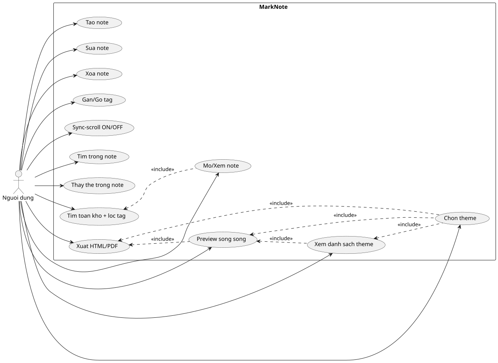

# So do Use-Case

## 1. So do

## 2. Chao thich

- Mot actor duy nhat: **Nguoi dung** (U01) - toan quyen.
- Quan he mo hinh `<<include>>`:
  - Muon **Preview** hay **Xuat** thi bat buoc phai co **theme** chon truoc.
  - Muon **Xem danh sach theme** thi phai co **Preview**.
  - Muon **Tim toan kho** thi note phai duoc **Mo** truoc (list note san co).

## 3. Tep nguon

`docs/diagrams/usecase.puml` - dinh dang PlantUML, xem cach ve trong
`CACH_VE_SO_DO.md`.